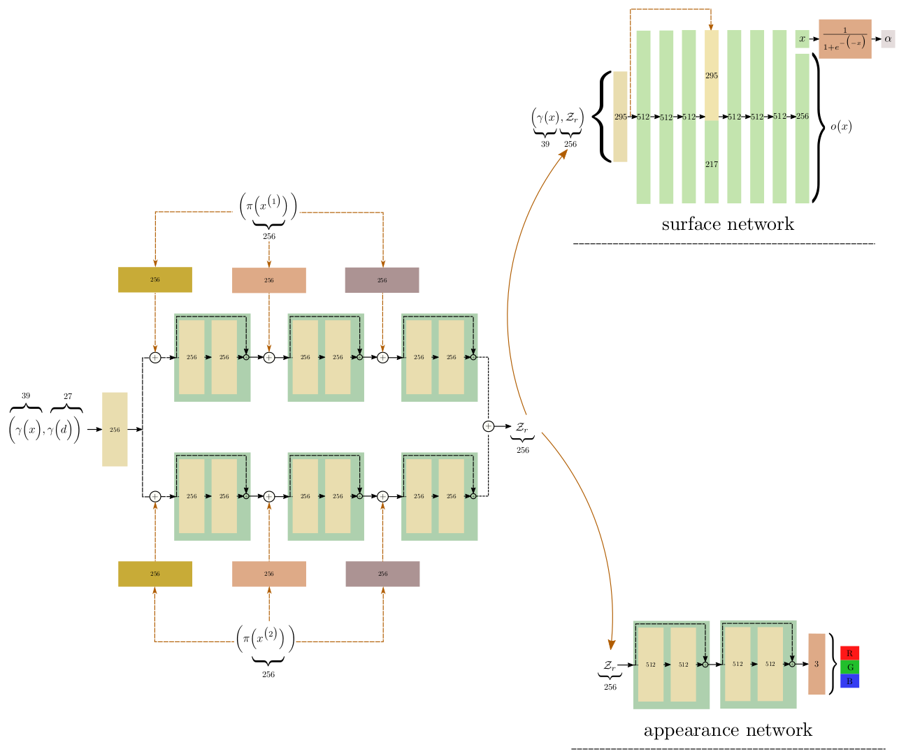
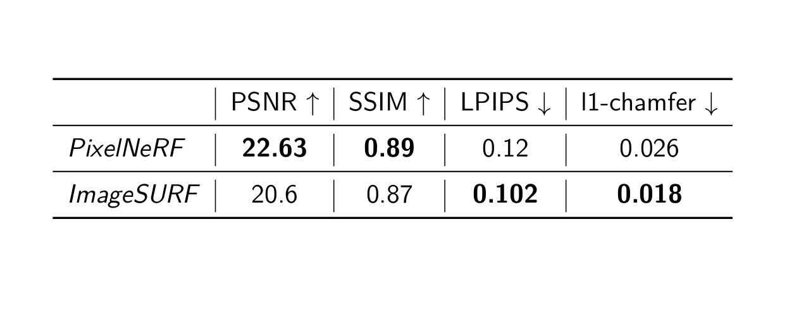

## ImageSURF

This repository corresponds to my Msc thesis 
[Reconstructing Surfaces with Appearance using
Neural Implicit 3D Representations](https://drive.google.com/file/d/1RWD3citDTZecb4INWwU3IhnqYikTQWd-/view?usp=sharing) implementation.

Specifically we proposed `ImageSURF` as a both surface and volumetric rendering
pipeline, for object specific `novel view synthesis` and `3D reconstruction`.

## Pipeline


## Installation
In orded to install the proper dependencies after cloning the repository, 
run the following commands to create the `nerf` environment.

```
conda env create -f environment.yaml
conda activate imagesurf
```

## Dataset
For the object specifc scenes we employed [ShapeNet](https://shapenet.org/) instances
similar preprocessed to the [srn](https://github.com/vsitzmann/scene-representation-networks).
Despite of the fact that out method is appliclable to all shapenet instances, our evaluation contains data only from the `srn_cars` instance due to resources limitation.

## Train
To train the nerf network for the givel `lego_dataset` run 

```
python run_nerf.puy --conf conf/nerf_config.yaml
```
## Render
To evaluate the trained model qualitatively run 

```
python reconstruction.py --conf conf/nerf_config.yaml --model_path checkpoints/<model_path> --render_path <render_path> 
```
## Extract Mesh
For 3D reconstruction you can extract colorless meshes through
that utilizes [marching cubes](https://github.com/pmneila/PyMCubes)
implemented by [pmneila](https://github.com/pmneila)
```
python reconstruction.py --model_path checkpoints/<model_path>  
```

## Qualitative Results
<video controls width="600">
  <source src="./media/gif_rgb.mp4" type="video/mp4">
  Your browser does not support the video tag.
</video>
<video controls width="600">
  <source src="./media/gif_depth.mp4" type="video/mp4">
  Your browser does not support the video tag.
</video>
<video controls width="600">
  <source src="./media/gifs_surf.mp4" type="video/mp4">
  Your browser does not support the video tag.
</video>

## Quantitative Results

